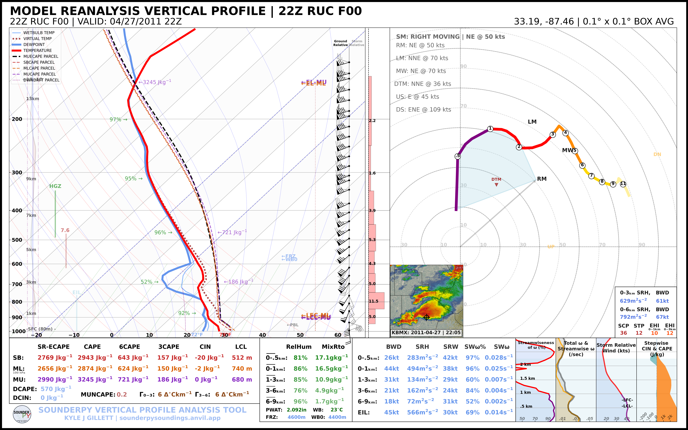
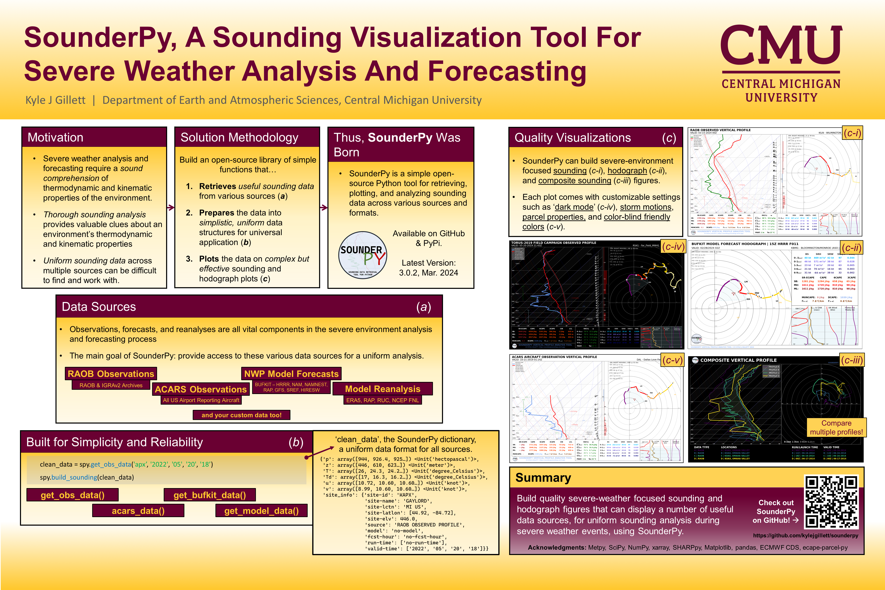

.. _about:

========
📖 About
========

About SounderPy: An Atmospheric Sounding Visualization and Analysis Tool for Python
======================================================================================

   *Example vertical-profile analysis produced with SounderPy.*

**SounderPy** is a simple, open-source Python package for retrieving, analyzing,
and plotting atmospheric vertical-profile (sounding) data. Built with simplicity
and reliability in mind, SounderPy's goal is to provide a uniform method for
sounding analysis across multiple data types and use cases.

Severe-weather analysis and forecasting require an understanding of the
thermodynamic and kinematic properties of the environment. SounderPy supports
this workflow through robust data access, atmospheric calculations, and custom
visualizations designed specifically for severe-weather analysis and
forecasting.

SounderPy can retrieve and plot:

* model forecast profiles;
* observed radiosonde profiles;
* Aircraft Communications Addressing and Reporting System (ACARS) profiles;
* model analysis and reanalysis profiles; and
* supported custom and numerical-model profiles.

Much of this functionality can be completed in only a few lines of Python,
making SounderPy approachable for both new and experienced Python users.

SounderPy builds on a number of scientific Python libraries, including NumPy,
Matplotlib, xarray, MetPy, SciPy, and SHARPpy. The project is available through
GitHub and PyPI and is distributed under the MIT License.

Read more about SounderPy in its Journal of Open Source Software article:

`SounderPy: An atmospheric sounding visualization and analysis tool for Python
<https://doi.org/10.21105/joss.08087>`_.

   *Overview of the SounderPy project and its capabilities. Presented to the Iowa Severe Storms and Doppler Radar Conference, 2023*

**********************************************

Community and Use
=================

SounderPy has been used by several institutions. For example, the tool has been
implemented by the Des Moines, Columbia, Grand Forks, Little Rock, Omaha, and
Grand Rapids National Weather Service offices; the State University of New York
at Albany; Mississippi State University; the University of North Dakota; and
others.

Students at a number of universities have also used SounderPy in projects,
posters, theses, and papers, including students at the University of Oklahoma,
Ohio State University, Central Michigan University, Iowa State University,
Texas A&M University, and Rizal Technological University.

☕ SounderPy is an open-source package developed independently. If you would
like to support continued development, consider
`buying me a coffee <https://www.buymeacoffee.com/kylejgillett>`_.

**********************************************

Citing SounderPy
================

If SounderPy contributes to your research, please cite the SounderPy Journal of
Open Source Software article.

**AMS-style citation**

   Gillett, K. J., 2025: SounderPy: An atmospheric sounding visualization and
   analysis tool for Python. *J. Open Source Software*, **10** (112), 8087,
   https://doi.org/10.21105/joss.08087.

.. image:: https://joss.theoj.org/papers/10.21105/joss.08087/status.svg
   :target: https://doi.org/10.21105/joss.08087
   :alt: JOSS publication status

**BibTeX**

.. code-block:: bibtex

   @article{Gillett2025SounderPy,
     author  = {Gillett, Kyle J.},
     title   = {SounderPy: An atmospheric sounding visualization and analysis tool for Python},
     journal = {Journal of Open Source Software},
     year    = {2025},
     volume  = {10},
     number  = {112},
     pages   = {8087},
     doi     = {10.21105/joss.08087},
     url     = {https://doi.org/10.21105/joss.08087}
   }

**********************************************

Authors and Contributors
========================

**Author**

* **Kyle J Gillett**, University of North Dakota

**Contributors**

* **Scott Thomas**, NWS Grand Rapids — VWP Hodograph and buoy-site listing
* **Amelia R H Urquhart**, University of Oklahoma — ``ecape-parcels`` library
* **Daryl Herzmann**, Iowa State University — SounderPy feedstock for conda-forge
* **Ryan Vandersmith** — Stepwise CAPE/CIN plot
* **David E Levin**, NOAA/NWS — Alaskan RAOB site IDs

**********************************************

About the Author
================

Hey!

Thanks for checking out and using SounderPy. My name is Kyle Gillett, and I am
a PhD student in Atmospheric Science at the University of North Dakota and the
developer of SounderPy.

SounderPy started as a way for me to internally organize the data-retrieval
functions I used when plotting atmospheric soundings. It has since grown into a
full-scale open-source Python package for vertical-profile retrieval, analysis,
and visualization.

SounderPy is published on PyPI and its source code is available on GitHub. If
you have found SounderPy useful in your work, I would love to hear about it.
One of the most rewarding parts of developing the project has been learning how
people are using it in forecasting, research, coursework, and other projects.

If you would like to support continued SounderPy development, consider
`buying me a coffee <https://www.buymeacoffee.com/kylejgillett>`_. ☕

**********************************************

Useful Links
============

* `SounderPy Sounding Analysis Site <https://sounderpysoundings.anvil.app/>`_
* `SounderPy on GitHub <https://github.com/kylejgillett/sounderpy>`_
* `SounderPy on PyPI <https://pypi.org/project/sounderpy/>`_
* `Kyle Gillett Photography <https://kylegillettphoto.com>`_
* `SounderPy updates on Twitter/X <https://twitter.com/wxkylegillett>`_
* `SounderPy updates on Bluesky <https://bsky.app/profile/wxkylegillett.bsky.social>`_
* `Support SounderPy development <https://www.buymeacoffee.com/kylejgillett>`_

**********************************************

Getting Started
===============

Ready to use SounderPy?

:doc:`Install SounderPy and create your first sounding → <getting_started>`

**********************************************

References
==========

SounderPy relies on a number of open-source scientific Python projects. Key
references include:

* Harris, C. R., K. J. Millman, S. J. van der Walt, and Coauthors, 2020:
  Array programming with NumPy. *Nature*, **585**, 357–362,
  https://doi.org/10.1038/s41586-020-2649-2.

* Hoyer, S., and J. Hamman, 2017: xarray: N-D labeled arrays and datasets in
  Python. *Journal of Open Research Software*, **5** (1), 10,
  https://doi.org/10.5334/jors.148.

* Hunter, J. D., 2007: Matplotlib: A 2D graphics environment.
  *Computing in Science & Engineering*, **9** (3), 90–95.

* May, R. M., S. C. Arms, P. Marsh, E. Bruning, J. R. Leeman, K. Goebbert,
  J. E. Thielen, Z. S. Bruick, and M. D. Camron, 2023: MetPy: A Python package
  for meteorological data. Unidata, https://doi.org/10.5065/D6WW7G29.

* May, R. M., S. C. Arms, J. R. Leeman, and J. Chastang, 2017: Siphon: A
  collection of Python utilities for accessing remote atmospheric and oceanic
  datasets. Unidata, https://doi.org/10.5065/D6CN72NW.

* Virtanen, P., R. Gommers, T. E. Oliphant, and Coauthors, 2020: SciPy 1.0:
  Fundamental algorithms for scientific computing in Python. *Nature Methods*,
  **17** (3), 261–272.

* Marsh, P., K. Halbert, G. Blumberg, T. Supinie, R. Esmaili, and
  J. Szkodzinski: SHARPpy: Sounding/Hodograph Analysis and Research Program in
  Python. `GitHub <https://github.com/sharppy/SHARPpy>`_.

*********************************************

Publications Using SounderPy
============================

* Barton, B., and C. Gormley, 2025: Analysis of strongly tornadic environments
  in Central and Eastern Europe utilizing ERA5 reanalysis data. M.S. thesis,
  University of Oklahoma.

* Capuli, G., M. A. Noveno, and M. P. Ibañez, 2025: A case study of the
  tornadic supercell in the Province of Pampanga, Philippines (27 May 2024).
  arXiv, https://doi.org/10.48550/arXiv.2504.20559.

* Capuli, G. H., 2024: Friday the 13th hailstorm in the province of Bulacan,
  Philippines (13 August 2021): A case study. arXiv,
  https://arxiv.org/abs/2412.09307.

* Capuli, G., 2024: Project Severe Weather Archive of the Philippines (SWAP)
  Part 1: Establishing a baseline climatology for severe weather across the
  Philippine Archipelago. *Ann. Geophys.*, **67** (5), GC553,
  https://doi.org/10.4401/ag-9151.

* Coffer, B. E., M. D. Parker, M. C. Coniglio, and C. R. Homeyer, 2025:
  Supercell environments using GridRad-Severe and the HRRR: Addressing
  discrepancies between prior tornado datasets. *Wea. Forecasting*, **40**,
  1405–1428, https://doi.org/10.1175/WAF-D-24-0251.1.

* Hua, Z., A. Anderson-Frey, M. C. Brown, and Q. Jiang, 2025: A data-driven
  explainable framework for diagnosing cluster assignments of right-moving
  tornadic supercell soundings. Preprint, 4 Jul 2025.

* Ibañez, M. P. A., J. A. Manalo, G. H. Capuli, and Coauthors, 2025:
  Spatiotemporal analysis of hail events in the Philippines.
  *Asia-Pac. J. Atmos. Sci.*, **61**, 24,
  https://doi.org/10.1007/s13143-025-00409-4.

* Kramer, A. D., 2025: The influence of complex terrain on the Turin, New York
  tornado of 2023. Atmospheric and Environmental Sciences Honors Program, 1,
  University at Albany,
  https://scholarsarchive.library.albany.edu/cas-daes-honors/1.

* Logan, T., X. Dong, B. Xi, X. Zheng, L. Wu, A. Abramowitz, and Coauthors,
  2024: Assessing radiative impacts of African smoke aerosols over the
  southeastern Atlantic Ocean. *Earth Space Sci.*, **11**, e2023EA003138,
  https://doi.org/10.1029/2023EA003138.

* Logan, T., J. Hale, S. Butler, B. Lawrence, and S. Gardner, 2024: Occurrence
  of rare lightning events during Hurricane Nicholas (2021).
  *Earth Space Sci.*, **11**, e2024EA003733,
  https://doi.org/10.1029/2024EA003733.

* Logan, T., B. Smith, K. Calindi, C. White, and I. Jones, 2025: Comparison
  study of the electrical nature of two smoke-enhanced sea-breeze thunderstorm
  cases during TRACER. *J. Geophys. Res. Lett.*, submitted.

* O'Neill, E., 2025: The sensitivity of the impact of cell mergers on supercell
  thunderstorms before versus after sunset. M.S. thesis, Department of Earth
  Science, University of North Carolina at Charlotte, Charlotte, NC.

* Staněk, M., 2024: Podmínky při vývoji weak-forcing derech ve střední Evropě.
  M.S. thesis, Department of Physical Geography and Geoecology, Faculty of
  Science, Charles University, Prague, Czech Republic.

* Yattoni, A., 2024: The horizontal displacement of Macomb's X-band and
  Davenport and Lincoln's S-band radar images caused by atmospheric
  conditions. Master's thesis, Department of Earth, Atmospheric, and
  Geographic Information Sciences, Western Illinois University. Available from
  ProQuest Dissertations & Theses Global.
