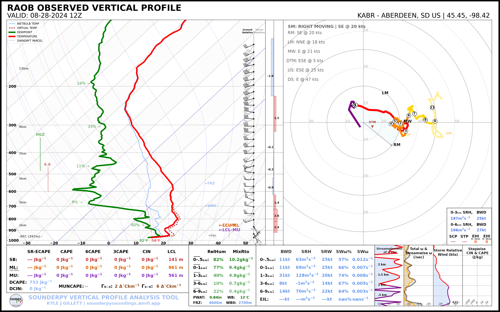
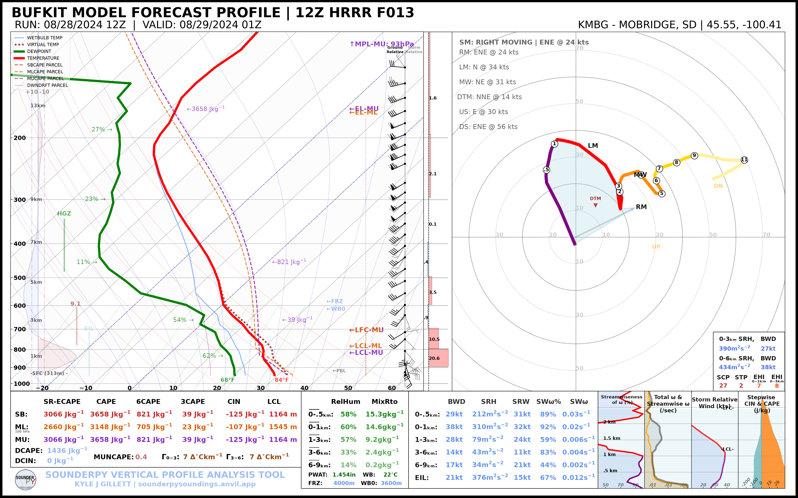
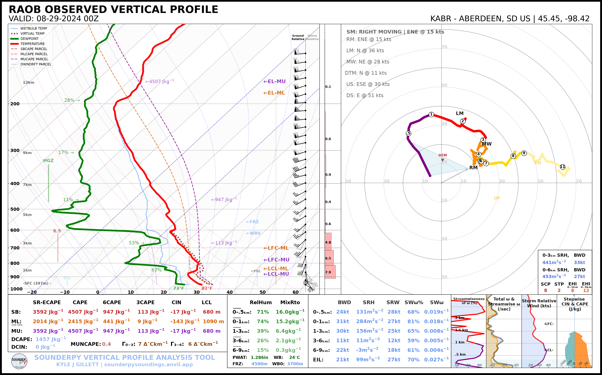
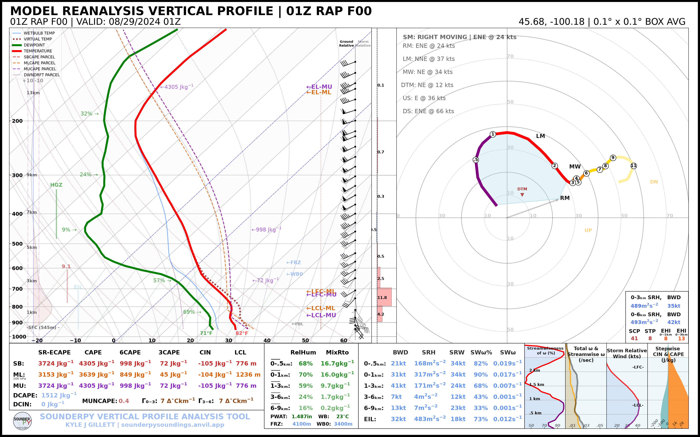
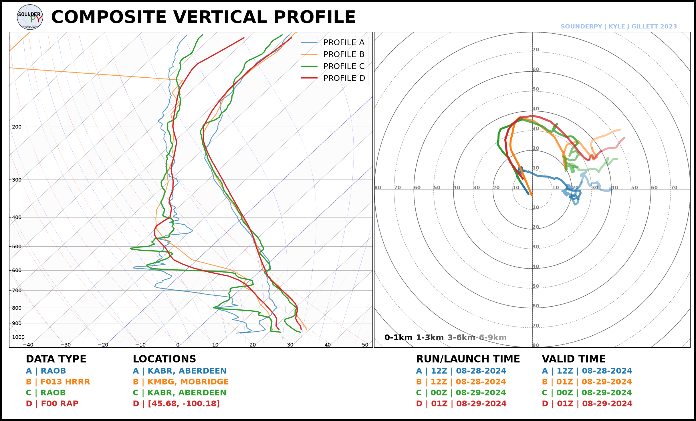

.. _case-study-mound-city-20240828:

=========================================================
🌪️ Case Study: Mound City, SD
=========================================================

\ 
 
   *A wide view of the supercell as it was producing a tornado west of
   Mound City, South Dakota.*

********************************************************

On the evening of 28 August 2024, a supercell produced multiple tornadoes near
Mound City, South Dakota along the intersection of the Missouri River and the 
South Dakota-North Dakota border. National Weather Service Aberdeen's damage 
survey rated the first major tornado **EF2**, with estimated peak winds of **130 mph**,
a path length of **5.42 miles**, and a maximum width of **200 yards**.

The tornado began at approximately **7:50 PM CDT** on 28 August
(**00:50 UTC on 29 August**) west-southwest of Mound City and persisted through
approximately 8:20 PM CDT. The event later produced additional tornadic
circulations east and southeast of Mound City.

A complete NWS survey and review of this event can be found from `NWS Aberdeen: 28 August 2024 Tornado Event
<https://www.weather.gov/abr/August28th2024TornadoEvent>`_

********************************************************

Case Study Goals
================

This example asks a simple forecasting question:

**How did the thermodynamic and kinematic environment evolve from the morning
forecast period into the time of tornadogenesis?**

We will compare four profiles:

.. list-table::
   :header-rows: 1
   :widths: 24 22 22 32

   * - Profile
     - Valid Time
     - Location
     - Purpose
   * - **Morning ABR RAOB**
     - 12 UTC 28 Aug
     - Aberdeen, SD
     - Observed morning environment
   * - **12 UTC HRRR Forecast**
     - 01 UTC 29 Aug
     - Mobridge, SD (KMBG)
     - Morning model forecast for event time
   * - **Evening ABR RAOB**
     - 00 UTC 29 Aug
     - Aberdeen, SD
     - Observed evening regional environment
   * - **RAP Analysis**
     - 01 UTC 29 Aug
     - Near the tornado track
     - Local model analysis during tornadogenesis

This combination lets us examine three different questions:

#. How did the observed regional environment change from 12 UTC to 00 UTC?
#. What did the morning HRRR forecast suggest the environment would look like
   near event time?
#. How did a local RAP analysis near Mound City compare with the regional ABR
   observation and morning forecast?

Event Timeline
==============

The first tornado occurred shortly after 00 UTC on 29 August.

.. code-block:: text

   28 August 2024

   12 UTC /  7:00 AM CDT   ABR morning RAOB
          │
          │     HRRR 12 UTC forecast evolves toward event time
          │
   00 UTC /  7:00 PM CDT   ABR evening RAOB
          │
   00:50 UTC / 7:50 PM CDT EF2 tornado begins
          │
   01 UTC /  8:00 PM CDT   RAP analysis / HRRR forecast comparison
          │
   01:20 UTC / 8:20 PM CDT first EF2 tornado ends

A Note on Spatial Representativeness
====================================

The ABR radiosonde is an important observed regional profile, but Aberdeen is
east of the Mound City tornado track. It should therefore be interpreted as a
**regional observed environment**, not as a direct measurement of the
near-storm inflow at Mound City.

The RAP analysis is sampled near the tornado track to provide a more local
estimate of the environment. Likewise, the HRRR BUFKIT profile uses **KMBG
(Mobridge)** because it is much closer to the Mound City area than Aberdeen.

This distinction is important in severe-weather analysis: proximity soundings
from models and observations each provide useful but different information.

*********************************************************

1. Morning Observed Environment
=============================================

First retrieve the Aberdeen (`KABR`) observed sounding from the morning of the event:

.. code-block:: python

   import sounderpy as spy

   abr_12z = spy.get_obs_data("KABR", "2024", "08", "28", "12", hush=True)

Plot the sounding:

.. code-block:: python

   spy.build_sounding(abr_12z, radar=None, map_zoom=0)

\ 
 
- The 12 UTC sounding provides a baseline for the morning environment

*********************************************************

2. Morning HRRR Forecast
==========================================

A useful forecast comparison is the **12 UTC HRRR run**, initialized around
7 AM CDT, evaluated at approximately 01 UTC on 29 August.

From a 12 UTC initialization, 01 UTC corresponds to forecast hour 13.

Using the Mobridge, SD (`KMBG`) BUFKIT site:

.. code-block:: python

   hrrr_f13 = spy.get_bufkit_data("hrrr", "KMBG", 13, "2024", "08", "28", "12", hush=True,)

\ 
 
- This profile represents what a forecaster using the morning HRRR could have examined for the environment near the expected event time.

.. note::

   BUFKIT archive availability can vary by model, station, and cycle. The
   companion script uses KMBG because HRRR BUFKIT data are available for that
   station in the archive.

*********************************************************

3. Evening Observed Environment
=============================================

The nominal 00 UTC Aberdeen (`KABR`) sounding was taken near the beginning of the
evening severe-weather period:

.. code-block:: python

   abr_00z = spy.get_obs_data("ABR", "2024", "08", "29", "00", hush=True)

\ 
 
- Comparing the 12 UTC and 00 UTC observations provides a direct look at the regional environmental evolution over the course of the day.

************************************************************

4. Local RAP Reanalysis
=====================================

The first EF2 tornado began around 00:50 UTC. An hourly RAP analysis at 01 UTC
therefore provides a useful near-event model analysis.

The sample location below is near the documented first tornado track:

.. code-block:: python

   mound_city = [45.68, -100.18]

   rap_01z = spy.get_model_data("rap-ruc", mound_city, "2024", "08", "29", "01", box_avg_size=0.10, hush=True)

\ 
 
- The RAP profile is not an observation, but its local sampling makes it useful for evaluating spatial differences between the Aberdeen sounding and the environment near the tornadic supercell.

*********************************************************

5. Compare the Profiles
=======================

SounderPy can place all four profiles on the same thermodynamic diagram:

.. code-block:: python

   profiles = [abr_12z, hrrr_f13, abr_00z, rap_01z]

   spy.build_composite(profiles, shade_between=False, dark_mode='True',
       colors_to_use=[ "tab:blue", "tab:orange", "tab:green", "tab:red"],
       lw_to_use=[2, 2, 3, 3],
       save=True,
       filename="mound_city_environment_composite.png",
   )

\ 

The Thermodynamic Profile
--------------------------

- The composite is particularly useful for comparing:

   * warming between the morning and evening observations;
   * changes in boundary-layer moisture;
   * differences between the HRRR forecast and the analyzed/observed environment;
   * model-versus-observation differences in vertical temperature structure.

The Kinematic Profile
----------------------

- When comparing the hodographs, consider:

   * How much **low-level curvature** was present in each profile?
   * How did the low-level winds differ between the regional ABR observation and
   the near-storm RAP analysis?
   * How closely did the **12 UTC HRRR forecast** resemble the wind profile near
   the time of tornadogenesis?
   * How did the magnitude and orientation of **deep-layer shear** compare among
   the forecast, observation, and analysis?
   * Were important changes confined primarily to the low levels, or did the
   entire wind profile evolve?

Event Context
=============

The NWS Aberdeen event summary describes a supercell that developed from a
storm in western Corson County, moved into southern North Dakota, and later
interacted with newly developing storms to its south before moving east across
the Missouri River. After crossing the river, the storm produced multiple
tornadoes across Campbell County.

The first major tornado west/southwest of Mound City was rated EF2. The damage
survey documented transmission-tower damage as well as damage to farmsteads,
outbuildings, equipment, trees, and a travel trailer.

For the official event chronology, damage survey, radar imagery, photographs,
and tornado-track information, see:

`National Weather Service Aberdeen — August 28th 2024 Tornado Event
<https://www.weather.gov/abr/August28th2024TornadoEvent>`_

*********************************************************

Continue Exploring
==================

* :doc:`Working with Data Sources </tutorials/data_sources>`
* :doc:`Composite Soundings </tutorials/composite_soundings>`
* :doc:`Hodograph Options </tutorials/hodograph_options>`
* :doc:`Plot Gallery </examplegallery>`
