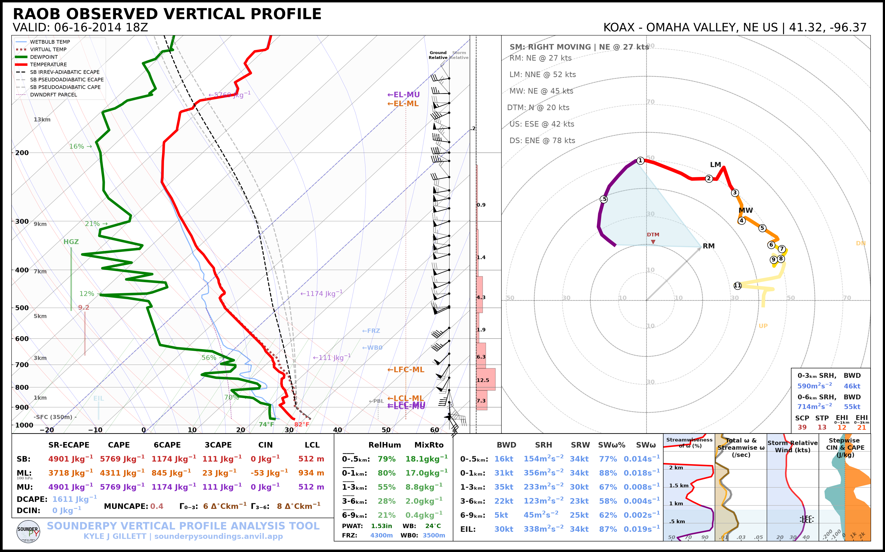
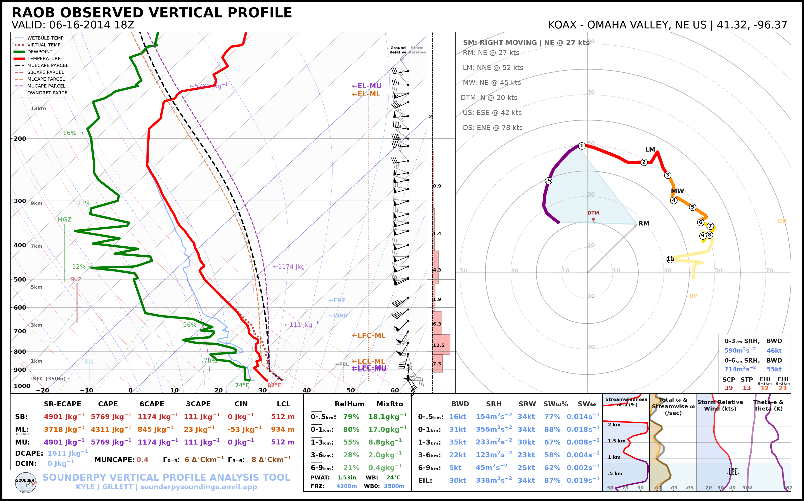
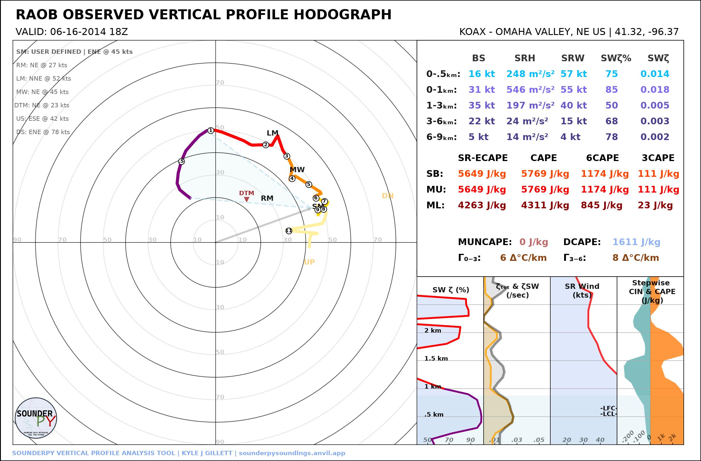
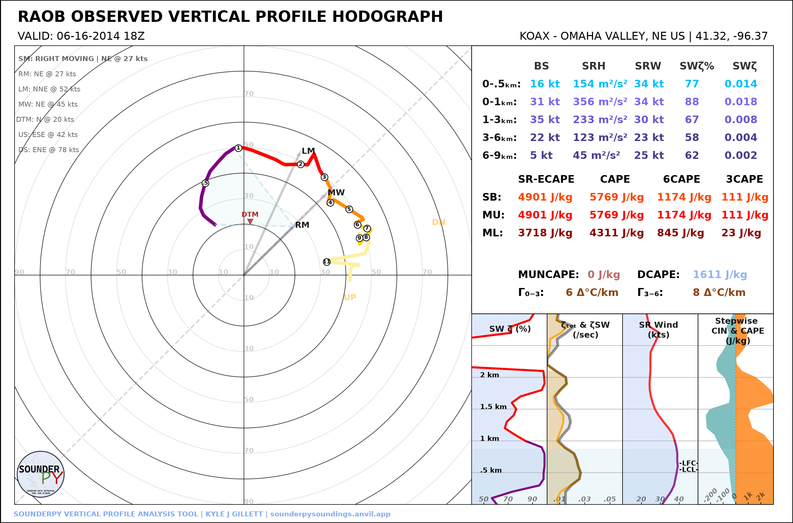

.. _plot-gallery:

================
📊 Plot Gallery
================

SounderPy can create sounding, hodograph, composite, and VAD-based visualizations
from observed, forecast, reanalysis, model-output, and custom vertical profile
data.

Most comparison examples use the same observed OAX sounding from
16 June 2014 at 18 UTC so that visual differences reflect plotting options
rather than differences in the atmospheric profile.

**Jump to:** :ref:`Themes <gallery-themes>` |
:ref:`Accessibility <gallery-accessibility>` |
:ref:`Maps and Radar <gallery-map-radar>` |
:ref:`Parcels <gallery-parcels>` |
:ref:`Hodograph Options <gallery-options>` |
:ref:`Data Sources <gallery-data-sources>` |
:ref:`Composite Soundings <gallery-composites>`

.. _gallery-themes:

Light and Dark Themes
=====================

The same SounderPy profile can be rendered using either the default light
appearance or the dark-background plotting style.

.. list-table::
   :widths: 50 50
   :class: gallery-table

   * - .. image:: _static/gallery/themes/sounding_light.png
          :alt: Light-mode SounderPy sounding
          :width: 100%

       **Light-Mode Sounding**

       Default SounderPy appearance.

       .. code-block:: python

          spy.build_sounding(
              data,
              dark_mode=False,
          )

     - .. image:: _static/gallery/themes/sounding_dark.png
          :alt: Dark-mode SounderPy sounding
          :width: 100%

       **Dark-Mode Sounding**

       Enable the dark-mode with: ``dark_mode=True``.

       .. code-block:: python

          spy.build_sounding(
              data,
              dark_mode=True,
          )

.. list-table::
   :widths: 50 50
   :class: gallery-table

   * - .. image:: _static/gallery/themes/hodograph_light.png
          :alt: Light-mode SounderPy hodograph
          :width: 100%

       **Light-Mode Hodograph**

       .. code-block:: python

          spy.build_hodograph(
              data,
              dark_mode=False,
          )

     - .. image:: _static/gallery/themes/hodograph_dark.png
          :alt: Dark-mode SounderPy hodograph
          :width: 100%

       **Dark-Mode Hodograph**

       .. code-block:: python

          spy.build_hodograph(
              data,
              dark_mode=True,
          )

.. _gallery-accessibility:

Color-Deficiency-Friendly Settings
==================================

SounderPy includes a color-deficiency-friendly option for sounding plots. This simply changes the dewpoint trace from green to blue.

.. list-table::
   :widths: 50 50
   :class: gallery-table

   * - .. image:: _static/gallery/accessibility/sounding_standard_colors.png
          :alt: SounderPy sounding using standard colors
          :width: 100%

       **Standard Colors**

       .. code-block:: python

          spy.build_sounding(
              data,
              color_blind=False,
          )

     - .. image:: _static/gallery/accessibility/sounding_colorblind.png
          :alt: SounderPy sounding using color-deficiency-friendly colors
          :width: 100%

       **Color-Deficiency-Friendly**

       .. code-block:: python

          spy.build_sounding(
              data,
              color_blind=True,
          )

.. _gallery-map-radar:

Map and Radar Settings
======================

The SounderPy map inset can be disabled, displayed without radar, or combined
with supported radar data.

.. list-table::
   :widths: 50 50
   :class: gallery-table

   * - .. image:: _static/gallery/map_radar/map_off.png
          :alt: SounderPy sounding with map disabled
          :width: 100%

       **Map Disabled**

       Set ``map_zoom=0`` to remove the map inset.

       .. code-block:: python

          spy.build_sounding(
              data,
              radar=None,
              map_zoom=0,
          )

     - .. image:: _static/gallery/map_radar/map_only.png
          :alt: SounderPy sounding with map enabled and radar disabled
          :width: 100%

       **Map Only**

       Display the map while disabling radar.

       .. code-block:: python

          spy.build_sounding(
              data,
              radar=None,
              map_zoom=2,
          )

.. list-table::
   :widths: 50 50
   :class: gallery-table

   * - .. image:: _static/gallery/map_radar/radar_single.png
          :alt: SounderPy sounding with single-site radar
          :width: 100%

       **Single-Site Radar**

       Use WSR-88D data from the nearest radar site.

       .. code-block:: python

          spy.build_sounding(
              data,
              radar="single",
              radar_time="sounding",
              map_zoom=2,
          )

     - .. image:: _static/gallery/map_radar/radar_mosaic.png
          :alt: SounderPy sounding with CONUS radar mosaic
          :width: 100%

       **Radar Mosaic**

       Use recent CONUS mosaic reflectivity data.

       .. code-block:: python

          spy.build_sounding(
              data,
              radar="mosaic",
              radar_time="sounding",
              map_zoom=2,
          )

Map Zoom
--------

The map extent can also be changed with ``map_zoom``. A larger integer will zoom out (including more of the map).

.. image:: _static/gallery/map_radar/map_zoom_4.png
   :alt: SounderPy sounding with a larger map extent
   :width: 70%
   :align: center

.. code-block:: python

   spy.build_sounding(
       data,
       radar=None,
       map_zoom=4,
   )

.. _gallery-parcels:

Parcel Settings
===============

SounderPy supports default parcel behavior, a simplified parcel configuration,
and custom parcel highlighting/background combinations.

.. list-table::
   :widths: 50 50
   :class: gallery-table

   * - .. image:: _static/gallery/parcels/parcels_default.png
          :alt: SounderPy sounding using default parcel settings
          :width: 100%

       **Default Parcels**

       Use SounderPy's standard parcel configuration.

       .. code-block:: python

          spy.build_sounding(
              data,
              special_parcels=None,
          )

     - .. image:: _static/gallery/parcels/parcels_simple.png
          :alt: SounderPy sounding using simple parcel settings
          :width: 100%

       **Simple Parcels**

       Use the simplified parcel configuration.

       .. code-block:: python

          spy.build_sounding(
              data,
              special_parcels="simple",
          )

Custom Parcel Configuration
---------------------------

Custom parcel settings allow selected parcel types to be highlighted while
others are displayed in the background.

For example:

.. code-block:: python

   custom_parcels = [
       ["sb_ia_ecape"],
       ["sb_ps_ecape", "sb_ps_cape"],
   ]

   spy.build_sounding(
       data,
       special_parcels=custom_parcels,
   )

.. _gallery-options:

Additional Plot Options
=======================

Theta and Theta-e
-----------------
If you'd like to maintain the classic low-level theta and theta-e profiles, you may do so by using `show_theta=True`:

.. code-block:: python

   spy.build_sounding(data, show_theta=True)

Ground-Relative vs Storm-Relative Hodographs
--------------------------------------------

You may translate hodograph data to a storm-relative reference frame with `sr_hodo=True`. This may be done **for hodograph and sounding plots**.

.. list-table::
   :widths: 50 50
   :class: gallery-table

   * - .. image:: _static/gallery/options/hodograph_ground_relative.png
          :alt: Ground-relative SounderPy hodograph
          :width: 100%

       **Ground Relative**

       .. code-block:: python

          spy.build_hodograph(
              data,
              sr_hodo=False,
          )

     - .. image:: _static/gallery/options/hodograph_storm_relative.png
          :alt: Storm-relative SounderPy hodograph
          :width: 100%

       **Storm Relative**

       .. code-block:: python

          spy.build_hodograph(
              data,
              sr_hodo=True,
          )

Custom Storm Motion
-------------------

You can set a custom storm motion using `storm_motion = [direction, speed]`. This may be done **for hodograph and sounding plots**.

.. code-block:: python

   spy.build_hodograph(data, storm_motion=[250.0, 45.0])

Hodograph Boundary
------------------

Here you can add a line to the hodograph plot to visualize the orientation of the flow relative to a nearby boundary (such as a cold front, outflow boundary, etc). This may be done **for hodograph and sounding plots**.

.. code-block:: python

   spy.build_hodograph(data, hodo_boundary={"angle": [45], "color": ["tab:purple"]})

.. _gallery-data-sources:

Different Data Sources
======================

One of SounderPy's core design features is that vertical profiles from many
different sources are converted into the same ``clean_data`` structure. Once a
profile has been retrieved or converted, the same plotting functions can be
used regardless of its source.

.. list-table::
   :widths: 50 50
   :class: gallery-table

   * - .. image:: _static/gallery/data_sources/data_raob.png
          :alt: SounderPy sounding using observed RAOB data
          :width: 100%

       **Observed RAOB**

       .. code-block:: python

          data = spy.get_obs_data(
              "OAX",
              "2014", "06", "16", "18",
          )

     - .. image:: _static/gallery/data_sources/data_rap_ruc.png
          :alt: SounderPy sounding using RAP/RUC reanalysis data
          :width: 100%

       **RAP/RUC Reanalysis**

       .. code-block:: python

          data = spy.get_model_data("rap-ruc",
              [44.58, -100.82],
              "2024", "08", "28", "18",
              box_avg_size=0.25)

.. list-table::
   :widths: 50 50
   :class: gallery-table

   * - .. image:: _static/gallery/data_sources/data_bufkit.png
          :alt: SounderPy sounding using BUFKIT forecast data
          :width: 100%

       **BUFKIT Forecast**

       .. code-block:: python

          data = spy.get_bufkit_data(
              "gfs",
              "KMOP",
              6,
              "2023", "08", "05", "12",
          )

     - .. image:: _static/gallery/data_sources/data_acars.png
          :alt: SounderPy sounding using ACARS aircraft data
          :width: 100%

       **ACARS Aircraft Profile**

       .. code-block:: python

          conn = spy.acars_data(
              "2024", "05", "21", "18",
          )

          profiles = conn.list_profiles()
          data = conn.get_profile(profiles[0])

The same approach also applies to ERA5, NCEP, WRF, CM1, and user-created custom
profiles.

See :doc:`Getting Data <gettingdata>` and
:doc:`Custom Data Sources <customdatasources>` for additional information.

.. _gallery-composites:

Composite Soundings
===================

Composite plots are useful for comparing temporal evolution, model forecasts,
observations versus reanalysis, or other groups of profiles.

.. list-table::
   :widths: 33 33 33
   :class: gallery-table

   * - .. image:: _static/gallery/composites/composite_light.png
          :alt: Light-mode SounderPy composite sounding
          :width: 100%

       **Light Composite**

       A standard multi-profile comparison.

     - .. image:: _static/gallery/composites/composite_dark.png
          :alt: Dark-mode SounderPy composite sounding
          :width: 100%

       **Dark Composite**

       With ``dark_mode=True``.

     - .. image:: _static/gallery/composites/composite_shaded.png
          :alt: SounderPy composite sounding with shading
          :width: 100%

       **Shaded Composite**

       With ``shade_between=True``.

Continue Learning
=================

For detailed explanations and additional examples, see:

* :doc:`📈 Plotting Data <plottingdata>`
* :doc:`🌎 Getting Data <gettingdata>`
* :doc:`✏️ Custom Data Sources <customdatasources>`
* :doc:`💻 Command Line Tool <cli>`