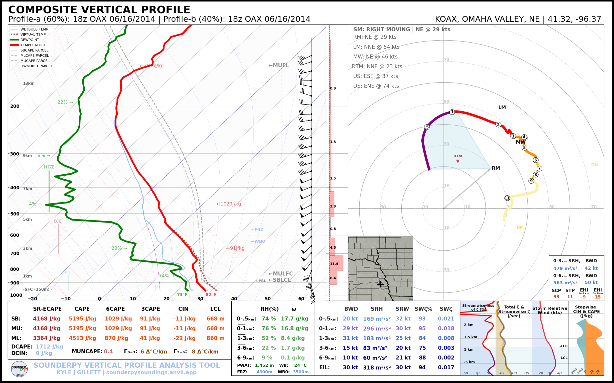
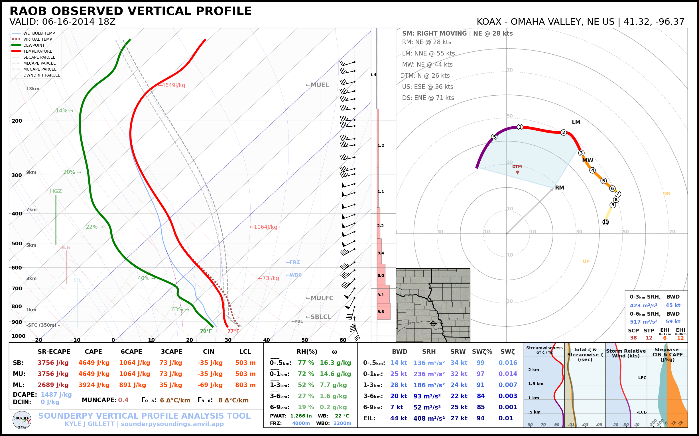

🛠️ Helper Tools
================

SounderPy includes several helper functions for profile calculations,
interpolation, file export, station lookup, and manipulation of ``clean_data``
profiles.

See :ref:`clean_data schema <clean_data_scheme>` for the common profile
structure used by these tools.

*************************

Returning a dictionary of profile parameters
--------------------------------------------

Calculate SounderPy's thermodynamic, kinematic, and interpolated profile parameters for a given ``clean_data`` profile.

The calculation returns four dictionaries containing:

- general profile information and derived quantities;
- thermodynamic parameters;
- kinematic parameters; and
- an interpolated version of the profile.

.. class:: sounding_params(clean_data, storm_motion='right_moving', modify_sfc=None)

   :param clean_data: the dictionary of profile data to calculate profile parameters for (see :doc:`gettingdata`)
   :type clean_data: dict, required
   :param storm_motion: the storm motion used for calculations. Default is 'right_moving'. Custom storm motions are accepted as a `list` of `floats` representing direction and speed. Ex: ``[270.0, 25.0]`` where '270.0' is the *direction in degrees* and '25.0' is the *speed in kts*. See the :ref:`storm_motions` section for more details.
   :type storm_motion: str or list of floats, optional
   :param modify_sfc: a `dict` in the format ``{'T': 25, 'Td': 21, 'ws': 20, 'wd': 270}`` to modify the surface values of the ``clean_data`` dict.
   :type modify_sfc: None or dict, optional, default is None

   .. py:function:: .calc()

      :return: Four dictionaries containing general, thermodynamic, kinematic,
               and interpolated profile data.
      :rtype: tuple

Example:

.. code-block:: python

   general, thermo, kinem, intrp = spy.sounding_params(clean_data).calc()

.. note::
   These calculated parameters are the same used on SounderPy plots. This function simply returns the master dictionary of all of these values.

****************************************************************

Saving data to a file
----------------------

.. py:function:: spy.to_file(file_type, clean_data, filename=None, convert_to_AGL=True)

   Create a file of 'cleaned' SounderPy data

   :param file_type: a `str` representing the file type you'd like to export data to.
   :type file_type: str, required
   :param clean_data: 'cleaned' SounderPy data `dict`
   :type clean_data: dict, required
   :param filename: output filename. If omitted, SounderPy uses its defaultoutput filename.
   :type filename: str, optional, default is ``None``
   :param convert_to_AGL: whether or not to convert height values to "above ground level" when saving to a file. Useful for CM1.
   :type convert_to_AGL: bool, optional, default is `True`
   :return: a file of SounderPy data.

Example:

- Supported ``file_type`` values are:

   - ``"csv"``
   - ``"sharppy"``
   - ``"cm1"``

.. code-block:: python

   spy.to_file("csv", clean_data, filename="sounding.csv")

   spy.to_file("sharppy", clean_data, filename="sounding.snd")

   spy.to_file("cm1", clean_data, filename="input_sounding")

See :ref:`tutorial-exporting-data` for complete export examples.

***************************************************************

Merging two profiles via weighted averaging
--------------------------------------------

Merge two profiles together using weighted averaging of values along a common height axis to return a single profile.

.. py:function:: spy.merge_profiles(profile_a, profile_b, weight_a)

   :param profile_a: a SounderPy `clean_data`dictionary containing variable arrays for profile_a.
   :type profile_a: dict, required
   :param profile_b: a SounderPy `clean_data` dictionary containing variable arrays for profile_b.
   :type profile_b: dict, required
   :param weight_a: the weight for `profile_a` in the averaging scheme, default is 0.5 (50%)
   :type weight_a: float, optional
   :return: a `clean_data` dictionary with weighted-averaged values for z, T, Td, u, v, and p **without metadata** (see example below)
   :rtype: dict

Example:

.. code-block:: python

    # load in some sounding data
    profile_a = spy.get_obs_data("OAX", "2014", "06", "16", "18")
    profile_b = spy.get_obs_data("OAX", "2014", "06", "17", "00")

    # apply `merge_profiles()` function
    merged_profile = spy.merge_profiles(profile_a, profile_b, weight_a=0.6)

    # reapply profile metadata and plot titles
    merged_profile['site_info'] = {'site-id': 'KOAX',
                              'site-name': 'OMAHA VALLEY',
                              'site-lctn': 'NE US',
                              'site-latlon': [41.32, -96.37],
                              'site-elv': 350,
                              'source': 'RAOB OBSERVED PROFILE',
                              'model': 'none',
                              'fcst-hour': 'none',
                              'run-time': 'none',
                              'valid-time': 'none',
                              'box_area': 'none'}
    merged_profile['titles'] =  {'top_title':   'COMPOSITE VERTICAL PROFILE',
                              'left_title':  'Profile-a (60%): 18z OAX 06/16/2014 | Profile-b (40%): 00z OAX 06/16/2014',
                              'right_title': 'KOAX, OMAHA VALLEY, NE | 41.32, -96.37    '}

    # build a sounding
    spy.build_sounding(merged_profile, radar=None, special_parcels='simple')

\ 
\ 

.. important::
   ``merge_profiles()`` returns the merged profile variables but does not
   automatically create new ``site_info`` or ``titles`` metadata. These should
   be supplied before producing a fully annotated SounderPy plot.

**************************************************

Smooth a profile
-----------------

Apply a simple ``SciPy`` gaussian smoother to a SounderPy ``clean_data`` profile

.. py:function:: spy.smooth_profile(clean_data, sigma)

   :param clean_data: a SounderPy `clean_data`dictionary.
   :type clean_data: dict, required
   :param sigma: standard deviation of the Gaussian kernel. Larger values produce stronger smoothing.
   :type sigma: float, optional, default is ``0.5``
   :return: a `clean_data` dictionary with smoothed values for z, T, Td, u, v, and p. Metadata remains unchanged.
   :rtype: dict

Here is an (extreme) example:

.. code-block:: python

    # load in some sounding data
    clean_data = spy.get_obs_data("OAX", "2014", "06", "16", "18")

    smoothed_profile = spy.smooth_profile(clean_data, 3)
    spy.build_sounding(smoothed_profile, radar=None, special_parcels='simple')

\ 
\ 
.. note::
   Smoothing alters the original observed or modeled profile. Use this tool
   carefully when calculating quantities that depend on sharp vertical
   gradients, such as lapse rates, inversions, shear, or parcel properties.

**************************************************

Finding a station latitude/longitude
--------------------------------------

.. py:function:: spy.get_latlon(station_type, station_id)

   Return the latitude and longitude associated with a supported station
   identifier.

   :param station_type: the station 'type' that corresponds with the given station ID
   :type station_type: str, required
   :param station_id: the station ID for the given station type
   :type station_id: str, required
   :return: lat/lon float pair
   :rtype: list

Example:

.. code-block:: python

   spy.get_latlon("metar", "KMOP")
   spy.get_latlon("bufkit", "APX")
   spy.get_latlon("raob", "OUN")
   spy.get_latlon("buoy", "45210")

.. tip::
   The returned ``[latitude, longitude]`` list can be passed directly to
   :ref:`get_model_data <modeldata>`.

***************************************************************

Interpolating a vertical profile
---------------------------------

.. py:function:: spy.interp_data(variable, heights, step=100)

   Interpolate a 1D array of data (such as a temperature profile) over a given interval (step) based on a corresponding array of height values. 

   :param variable: an array of data to be interpolated. Must be same length as height array.
   :type variable: array-like, required
   :param heights: heights corresponding to the vertical profile used to interpolate. Must be same length as variable array.
   :type heights: array-like, required
   :param step: the resolution of interpolation. Default is 100 (recommended value is 100)
   :type step: int, optional
   :return: interp_var, an array of interpolated data.
   :rtype: numpy.ndarray

Example:

.. code-block:: python

   spy.interp_data(temperature_array, height_array, step=100)  

***************************************************************

Finding a 'nearest' value
--------------------------

.. py:function:: spy.find_nearest(array, value)

	Return the index of the array element closest to a requested value.

   :param array: an array of data to be searched through
   :type array: arr, required
   :param value: Target value to locate within the array.
   :type value: int or float, required
   :return: nearest_idx, index of the data array that corresponds with the nearest value to the given value
   :rtype: int

Example:

.. code-block:: python

   idx_500m = spy.find_nearest(z, 500)

   print(z[idx_500m])

****************************************************************

Printing data to the console
-----------------------------

Print a compact summary of commonly used thermodynamic and kinematic parameters to the console.

.. py:function:: spy.print_variables(clean_data, storm_motion='right_moving', modify_sfc=None)

   :param clean_data: the dictionary of profile data to calculate profile parameters for (see :doc:`gettingdata`)
   :type clean_data: dict, required
   :param storm_motion: the storm motion used for calculations. Default is 'right_moving'. Custom storm motions are accepted as a `list` of `floats` representing direction and speed. Ex: ``[270.0, 25.0]`` where '270.0' is the *direction in degrees* and '25.0' is the *speed in kts*. See the :ref:`storm_motions` section for more details.
   :type storm_motion: str or list of floats, optional
   :param modify_sfc: a `dict` in the format ``{'T': 25, 'Td': 21, 'ws': 20, 'wd': 270}`` to modify the surface values of the ``clean_data`` dict.
   :type modify_sfc: None or dict, optional, default is None
   :return: ``None``. Calculated parameters are written to standard output.
   :rtype: None

.. code-block:: python

   spy.print_variables(clean_data, storm_motion="right_moving")

.. code-block:: python

   > THERMODYNAMICS ---------------------------------------------
   --- SBCAPE: 2090.8 | MUCAPE: 2090.8 | MLCAPE: 1878.3 | MUECAPE: 1651.9
   --- MU 0-3: 71.1 | MU 0-6: 533.0 | SB 0-3: 71.1 | SB 0-6: 533.0

   > KINEMATICS -------------------------------------------------
   --- 0-500 SRW: 35.0 knot | 0-500 SWV: 0.019 | 0-500 SHEAR: 21.8 | 0-500 SRH: 186.2
   --- 1-3km SRW: 20.9 knot | 1-3km SWV: 0.005 | 1-3km SHEAR: 14.1 | | 1-3km SRH: 54.0

**************************************************