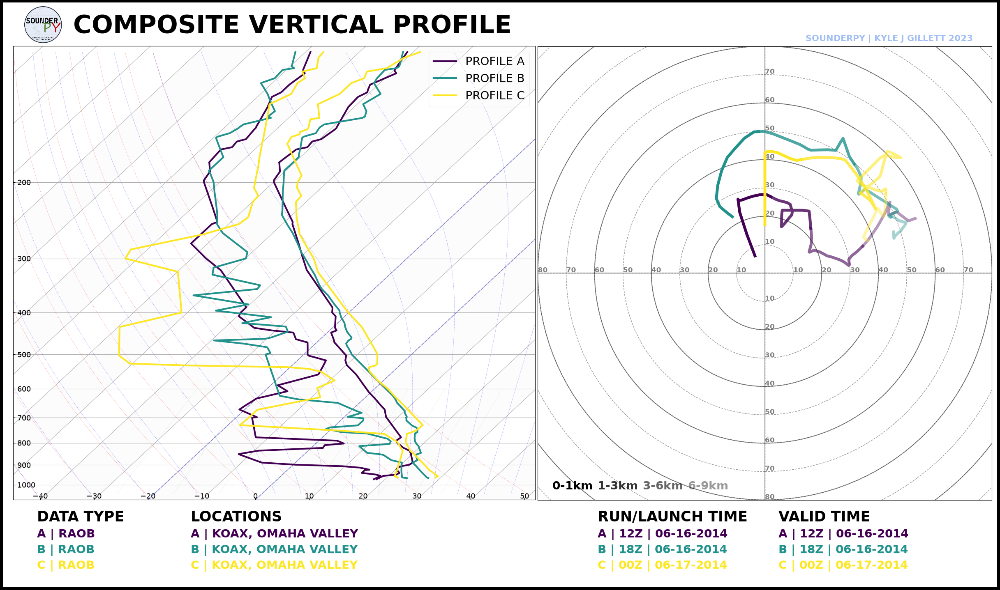
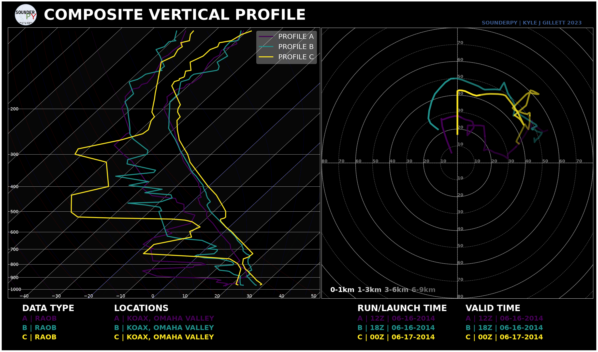
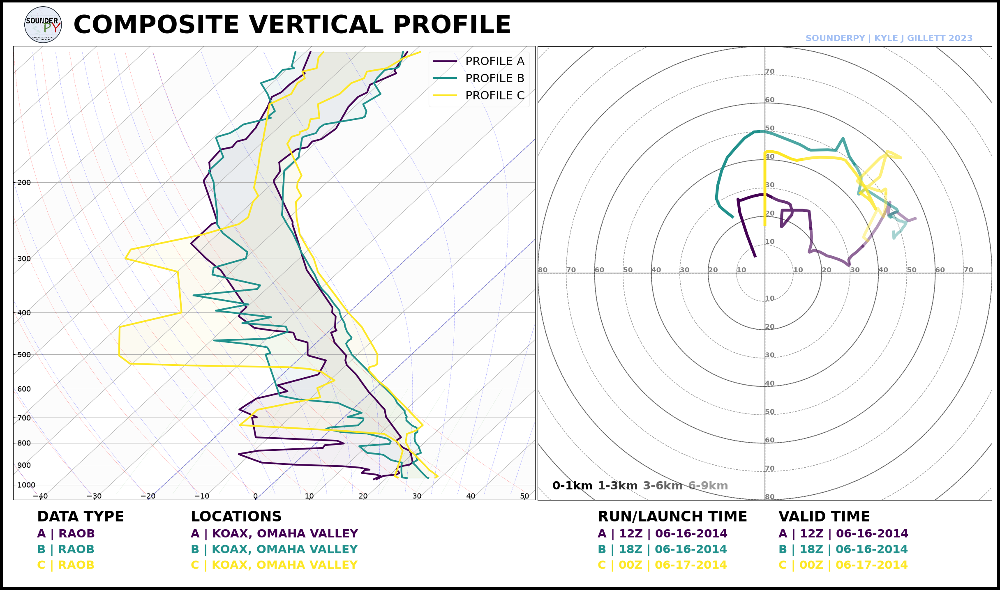

.. _tutorial-composite-soundings:

========================
📚 Composite Soundings
========================

Composite soundings place multiple vertical profiles on the same thermodynamic
diagram. They are useful for:

* comparing environmental evolution through time;
* comparing observations with model/reanalysis data;
* comparing forecast hours;
* comparing multiple nearby locations;
* comparing experimental or custom profiles.

SounderPy creates these figures with ``build_composite()``.

***************************************************************
 

Retrieve Several Profiles
=========================

This example compares three OAX soundings surrounding the 16 June 2014 severe
weather event:

.. code-block:: python

   import sounderpy as spy

   data_12z = spy.get_obs_data(
       "OAX", "2014", "06", "16", "12",
       hush=True,
   )

   data_18z = spy.get_obs_data(
       "OAX", "2014", "06", "16", "18",
       hush=True,
   )

   data_00z = spy.get_obs_data(
       "OAX", "2014", "06", "17", "00",
       hush=True,
   )

Put the profiles into a list:

.. code-block:: python

   profiles = [
       data_12z,
       data_18z,
       data_00z,
   ]

***************************************************************
 
Basic Composite
===============

Create the comparison with:

.. code-block:: python

   spy.build_composite(
       profiles,
       shade_between=False,
   )

***************************************************************
 

Dark-Mode Composite
===================

.. code-block:: python

   spy.build_composite(
       profiles,
       shade_between=False,
       dark_mode=True,
   )

***************************************************************
 

Shading between Temperature and Dewpoint
========================================

``shade_between=True`` lightly shades the region between each profile's
temperature and dewpoint traces:

.. code-block:: python

   spy.build_composite(
       profiles,
       shade_between=True,
   )

***************************************************************
 

Choosing a Colormap
===================

By default, SounderPy samples colors from ``viridis``. Any compatible
Matplotlib colormap can be supplied:

.. code-block:: python

   spy.build_composite(
       profiles,
       cmap="plasma",
   )

or:

.. code-block:: python

   spy.build_composite(
       profiles,
       cmap="coolwarm",
   )

***************************************************************
 

Custom Colors
=============

Provide one color for each profile with ``colors_to_use``:

.. code-block:: python

   spy.build_composite(
       profiles,
       colors_to_use=[
           "tab:blue",
           "tab:orange",
           "tab:red",
       ],
   )

If custom colors are supplied, the list length should match the number of
profiles.

***************************************************************
 

Line Styles
===========

Line styles can also be assigned profile-by-profile:

.. code-block:: python

   spy.build_composite(
       profiles,
       ls_to_use=[
           "--",
           "-",
           ":",
       ],
   )

***************************************************************
 

Line Widths
===========

.. code-block:: python

   spy.build_composite(
       profiles,
       lw_to_use=[
           2,
           4,
           2,
       ],
   )

***************************************************************
 
Opacity
=======

.. code-block:: python

   spy.build_composite(
       profiles,
       alphas_to_use=[
           0.6,
           1.0,
           0.6,
       ],
   )

***************************************************************
 
Combine Styling Options
=======================

For example, emphasize the middle profile:

.. code-block:: python

   spy.build_composite(
       profiles,
       colors_to_use=[
           "tab:blue",
           "tab:red",
           "tab:purple",
       ],
       ls_to_use=[
           "--",
           "-",
           "--",
       ],
       lw_to_use=[
           2,
           4,
           2,
       ],
       alphas_to_use=[
           0.6,
           1.0,
           0.6,
       ],
       shade_between=False,
   )

***************************************************************
 
Compare Different Data Sources
==============================

Composite inputs do not have to come from the same source.

For example:

.. code-block:: python

   profiles = [
       observed_data,
       rap_data,
       bufkit_data,
   ]

   spy.build_composite(
       profiles,
       colors_to_use=[
           "black",
           "tab:blue",
           "tab:orange",
       ],
   )

Because each source has already been converted into ``clean_data``,
``build_composite()`` can treat them consistently.

***************************************************************
 

Save the Figure
===============

.. code-block:: python

   spy.build_composite(
       profiles,
       shade_between=False,
       save=True,
       filename="oax_composite.png",
   )

***************************************************************
 

Next Steps
==========

Continue to :doc:`Exporting Data <exporting_data>` to save retrieved profiles
for other software and workflows.

See also:

* :doc:`Plotting Data </plottingdata>`
* :doc:`Working with Data Sources <data_sources>`
