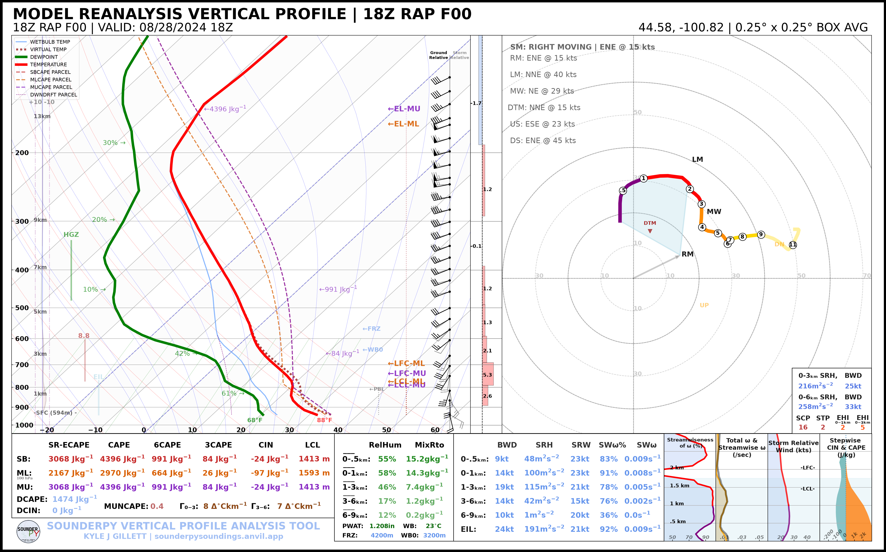
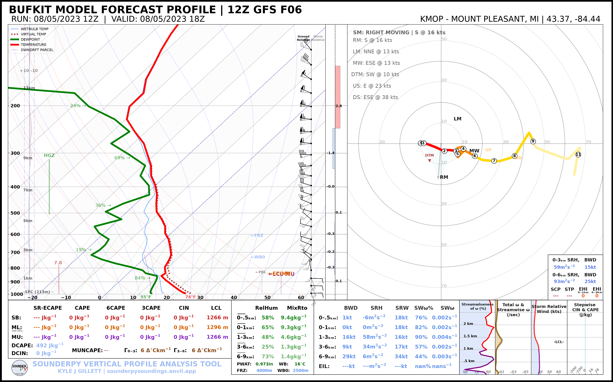

.. _tutorial-data-sources:

=============================
🌎 Working with Data Sources
=============================

One of SounderPy's central design ideas is that many different atmospheric
profile sources are converted into a common dictionary structure called
``clean_data``.

That means this:

.. code-block:: python

   spy.build_sounding(data)

works whether ``data`` came from an observed RAOB, RAP/RUC reanalysis, BUFKIT
forecast, ACARS aircraft profile, or another supported/converted source.

This tutorial demonstrates four common retrieval workflows and introduces the
shared ``clean_data`` structure.

***************************************************************
 

The Core ``clean_data`` Structure
=================================

A typical cleaned profile contains at least:

.. code-block:: text

   clean_data
   ├── p          pressure
   ├── z          height
   ├── T          temperature
   ├── Td         dewpoint
   ├── u          u-component wind
   ├── v          v-component wind
   └── site_info  profile metadata

Many SounderPy profiles also contain plotting metadata such as ``titles`` or
derived wind-direction/wind-speed fields.

The meteorological arrays use MetPy/Pint units. For example:

.. code-block:: python

   print(data["p"])
   print(data["T"])
   print(data["u"])

Profile metadata are stored beneath:

.. code-block:: python

   data["site_info"]

Useful metadata may include:

.. code-block:: python

   data["site_info"]["site-id"]
   data["site_info"]["site-name"]
   data["site_info"]["site-latlon"]
   data["site_info"]["source"]
   data["site_info"]["model"]
   data["site_info"]["valid-time"]

***************************************************************
 
Observed RAOB / IGRA Profiles
=============================

Retrieve an observed sounding with ``get_obs_data()``:

.. code-block:: python

   import sounderpy as spy

   raob = spy.get_obs_data(
       "OAX",
       "2014",
       "06",
       "16",
       "18",
       hush=True,
   )

Plot it normally:

.. code-block:: python

   spy.build_sounding(
       raob,
       radar=None,
       map_zoom=0,
   )

.. image:: ../_static/gallery/data_sources/data_raob.png
   :alt: SounderPy sounding using observed RAOB data
   :width: 82%
   :align: center

The ``station`` argument may be a supported RAOB station identifier or IGRAv2
identifier.

***************************************************************
 

RAP/RUC Reanalysis
==================

RAP/RUC profiles are requested through ``get_model_data()``:

.. code-block:: python

   rap = spy.get_model_data(
       "rap-ruc",
       [44.58, -100.82],
       "2024",
       "08",
       "28",
       "18",
       box_avg_size=0.25,
       hush=True,
   )

The location is given as:

.. code-block:: python

   [latitude, longitude]

and ``box_avg_size`` controls the area-average box size in degrees.

For modern RAP data, SounderPy's RAP/RUC workflow uses GRIB2 retrieval with the
configured archive/fallback logic before converting the profile into
``clean_data``.

***************************************************************
 
Other Model/Reanalysis Sources
==============================

The same model interface is used for other supported model/reanalysis sources:

.. code-block:: python

   data = spy.get_model_data(
       "era5",
       [44.58, -100.82],
       "2024", "08", "28", "18",
       hush=True,
   )

or:

.. code-block:: python

   data = spy.get_model_data(
       "ncep",
       [44.58, -100.82],
       "2024", "08", "28", "18",
       hush=True,
   )

Some sources may require additional credentials, external services, or
source-specific data availability. See :doc:`Getting Data </gettingdata>` for
the current requirements.

***************************************************************
 

BUFKIT Forecast Profiles
========================

A current/recent BUFKIT profile can be requested with:

.. code-block:: python

   bufkit = spy.get_bufkit_data(
       "gfs",
       "KMOP",
       6,
       hush=True,
   )

The first three arguments are:

.. code-block:: text

   model
   station
   forecast hour

For an archived model run, provide the initialization date/time:

.. code-block:: python

   bufkit = spy.get_bufkit_data(
       "gfs",
       "KMOP",
       6,
       "2023",
       "08",
       "05",
       "12",
       hush=True,
   )

***************************************************************
 

ACARS Aircraft Profiles
=======================

ACARS retrieval is a two-step workflow.

First, create a connection for the requested date/hour:

.. code-block:: python

   acars = spy.acars_data(
       "2024",
       "05",
       "21",
       "18",
   )

List available profiles:

.. code-block:: python

   profiles = acars.list_profiles()
   print(profiles)

Then retrieve one returned profile ID:

.. code-block:: python

   data = acars.get_profile(
       profiles[0],
       hush=True,
   )

ACARS profile identifiers are archive-dependent, so listing profiles first is
the most robust workflow.

***************************************************************
 
Why ``clean_data`` Matters
==========================

After retrieval, all four examples can use the same plotting function:

.. code-block:: python

   spy.build_sounding(raob)
   spy.build_sounding(rap)
   spy.build_sounding(bufkit)
   spy.build_sounding(data)

The same is true for:

.. code-block:: python

   spy.build_hodograph(...)
   spy.sounding_params(...)
   spy.to_file(...)

This separation between **retrieval** and **analysis/plotting** is what allows
SounderPy workflows to remain consistent across different source types.

***************************************************************
 

Model Output and Custom Data
============================

SounderPy also includes utilities for converting model/custom inputs into
``clean_data``.

CM1 input sounding:

.. code-block:: python

   metadata = {
       "latlon": [48.57, -100.98],
       "elev": 450,
       "top_title": "CM1 INPUT SOUNDING",
       "left_title": "CUSTOM PROFILE",
       "right_title": "CM1",
   }

   cm1_data = spy.make_cm1_profile(
       "input_sounding",
       metadata,
   )

WRF output can similarly be converted with ``spy.make_wrf_profile(...)``.

Once converted, these profiles use the same SounderPy analysis and plotting
functions as retrieved profiles.

See :doc:`Custom Data Sources </customdatasources>` for detailed input
requirements.

***************************************************************
 
CLI Equivalents
===============

Observed profile:

.. code-block:: bash

   sounderpy obs OAX 2014-06-16 18

RAP/RUC:

.. code-block:: bash

   sounderpy model rap-ruc 44.58 -100.82 2024-08-28 18 \
       --box-size 0.25

Archived BUFKIT:

.. code-block:: bash

   sounderpy bufkit gfs KMOP 6 \
       --run 2023-08-05 12

List ACARS profiles:

.. code-block:: bash

   sounderpy acars list 2024-05-21 18

Next Steps
==========

Continue to :doc:`Composite Soundings <composite_soundings>` to compare
multiple profiles on one figure.

See also:

* :doc:`Getting Data </gettingdata>`
* :doc:`Custom Data Sources </customdatasources>`
