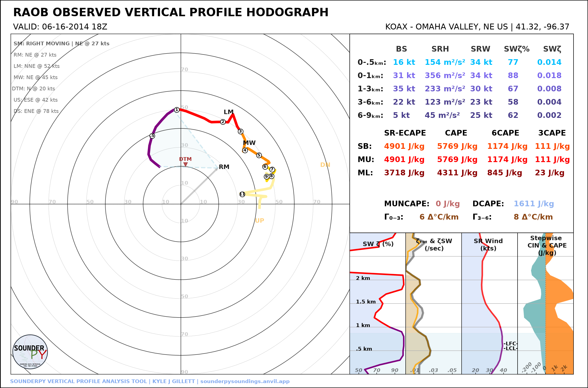
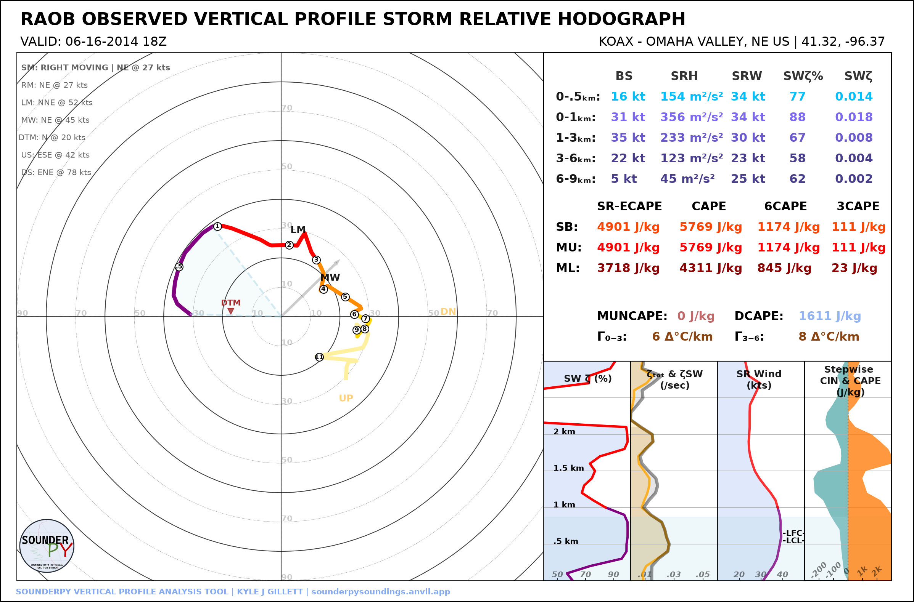

.. _tutorial-hodograph-options:

====================
🌀 Hodograph Options
====================

SounderPy's standalone hodograph can be displayed in ground-relative or
storm-relative coordinates and can use an automatically calculated or
user-defined storm motion.

This tutorial covers:

* ground-relative hodographs;
* storm-relative hodographs;
* right-moving, left-moving, and mean-wind storm motions;
* user-defined storm motion;
* hodograph boundary overlays;
* dark mode and saved figures.

***************************************************************
 
Retrieve the Example Profile
============================

.. code-block:: python

   import sounderpy as spy

   data = spy.get_obs_data(
       "OAX",
       "2014", "06", "16", "18",
       hush=True,
   )

***************************************************************
 
Ground-Relative Hodograph
=========================

The default hodograph is ground relative:

.. code-block:: python

   spy.build_hodograph(
       data,
       sr_hodo=False,
       radar=None,
       map_zoom=0,
   )

***************************************************************
 

Storm-Relative Hodograph
========================

Set ``sr_hodo=True`` to subtract the selected storm-motion vector from the
winds:

.. code-block:: python

   spy.build_hodograph(
       data,
       sr_hodo=True,
       radar=None,
       map_zoom=0,
   )

Storm-relative plotting requires a valid storm-motion vector. If SounderPy
cannot determine one from the profile, the plot falls back to a ground-relative
hodograph.

***************************************************************
 
Selecting Storm Motion
======================

The default storm motion is:

.. code-block:: python

   storm_motion="right_moving"

Common supported string forms include:

.. code-block:: python

   storm_motion="right_moving"
   storm_motion="left_moving"
   storm_motion="mean_wind"

These select the right-moving Bunkers motion, left-moving Bunkers motion, or
mean-wind motion used by SounderPy calculations.

***************************************************************
 

User-Defined Storm Motion
=========================

A custom storm motion can be supplied as:

.. code-block:: python

   [direction_degrees, speed_knots]

For example:

.. code-block:: python

   spy.build_hodograph(
       data,
       storm_motion=[250.0, 45.0],
       radar=None,
       map_zoom=0,
   )

.. image:: ../_static/gallery/options/hodograph_custom_storm_motion.png
   :alt: SounderPy hodograph using custom storm motion
   :width: 78%
   :align: center

The same custom motion can be used for a storm-relative hodograph:

.. code-block:: python

   spy.build_hodograph(
       data,
       storm_motion=[250.0, 45.0],
       sr_hodo=True,
       radar=None,
       map_zoom=0,
   )

***************************************************************
 
Hodograph Boundaries
====================

A straight boundary axis can be added using ``hodo_boundary``.

The argument is a dictionary containing matching lists of angles and colors:

.. code-block:: python

   boundary = {
       "angle": [45],
       "color": ["tab:purple"],
   }

   spy.build_hodograph(
       data,
       hodo_boundary=boundary,
       radar=None,
       map_zoom=0,
   )

.. image:: ../_static/gallery/options/hodograph_boundary.png
   :alt: SounderPy hodograph with a boundary overlay
   :width: 78%
   :align: center

Multiple boundaries can be supplied:

.. code-block:: python

   boundary = {
       "angle": [45, 120],
       "color": ["tab:purple", "tab:blue"],
   }

***************************************************************
 
Theme and Output Options
========================

Dark mode:

.. code-block:: python

   spy.build_hodograph(
       data,
       dark_mode=True,
       radar=None,
       map_zoom=0,
   )

Save at higher resolution:

.. code-block:: python

   spy.build_hodograph(
       data,
       radar=None,
       map_zoom=0,
       dpi=200,
       save=True,
       filename="oax_hodograph.png",
   )

***************************************************************
 
CLI Examples
============

Save a ground-relative hodograph:

.. code-block:: bash

   sounderpy obs OAX 2014-06-16 18 \
       --plot hodograph \
       --map-zoom 0 \
       --plot-file oax_hodograph.png

Save a storm-relative hodograph:

.. code-block:: bash

   sounderpy obs OAX 2014-06-16 18 \
       --plot hodograph \
       --storm-relative \
       --map-zoom 0 \
       --plot-file oax_sr_hodograph.png

Save a dark storm-relative hodograph:

.. code-block:: bash

   sounderpy obs OAX 2014-06-16 18 \
       --plot hodograph \
       --storm-relative \
       --dark-mode \
       --map-zoom 0 \
       --plot-file oax_sr_dark.png

Next Steps
==========

Continue to :doc:`Working with Data Sources <data_sources>` to see how
different profile sources feed the same SounderPy plotting workflow.

See also:

* :doc:`Plotting Data </plottingdata>`
