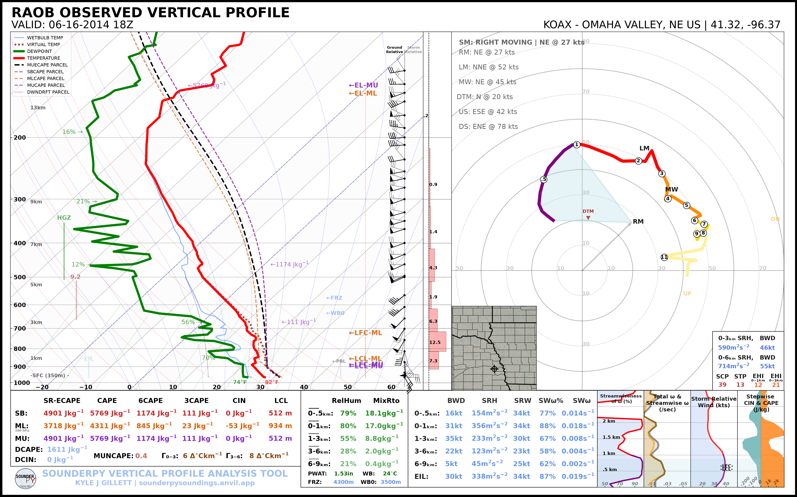
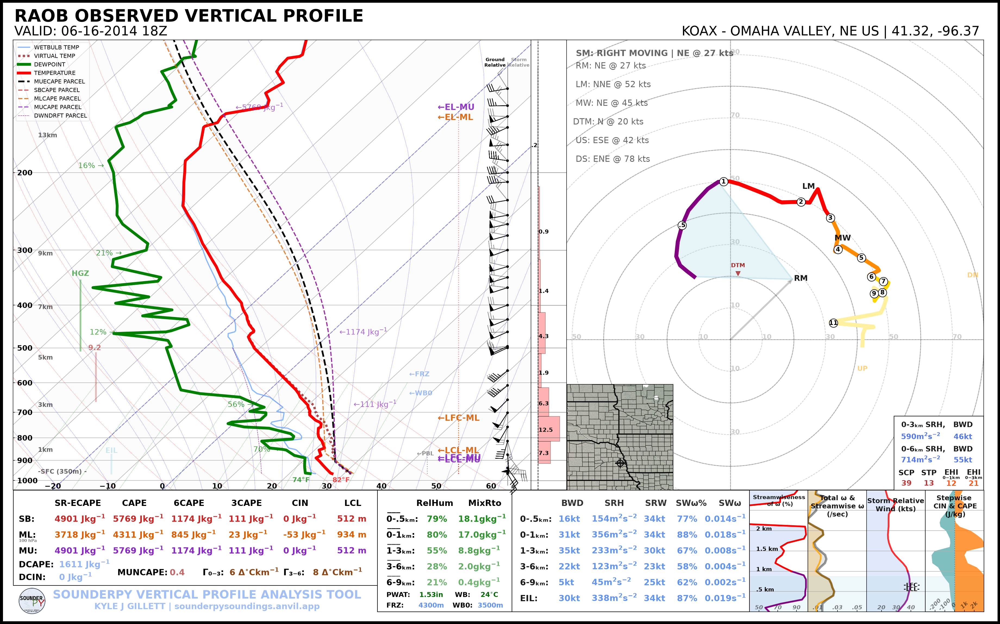
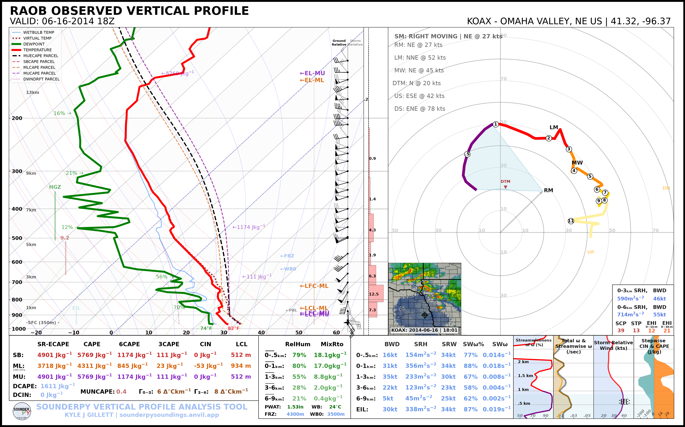
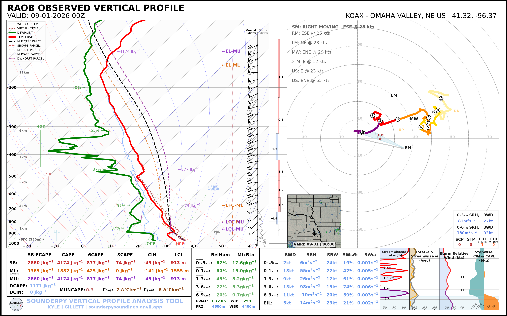

.. _tutorial-maps-radar:

================
🗺️ Maps & Radar
================

SounderPy sounding and hodograph plots can include a geographic inset showing
the profile location and, when available, radar reflectivity.

This tutorial covers:

* disabling the map entirely;
* displaying the map without radar;
* changing the map extent;
* displaying single-site WSR-88D reflectivity;
* displaying recent CONUS mosaic reflectivity;
* selecting the radar valid time.

.. note::

   Map and radar features require internet access to external data and mapping
   services. Radar availability also depends on the requested date, location,
   and upstream archive.

***************************************************************
 
Retrieve an Example Sounding
============================

The archived examples use the OAX sounding from 16 June 2014 at 18 UTC:

.. code-block:: python

   import sounderpy as spy

   data = spy.get_obs_data(
       "OAX",
       "2014", "06", "16", "18",
       hush=True,
   )

***************************************************************
 
Disable the Map
===============

Set ``map_zoom=0`` to hide the map inset:

.. code-block:: python

   spy.build_sounding(
       data,
       radar=None,
       map_zoom=0,
   )

.. image:: ../_static/gallery/map_radar/map_off.png
   :alt: SounderPy sounding with the map disabled
   :width: 85%
   :align: center

This is useful when:

* the map does not add useful context;
* you are creating a cleaner publication figure;
* you are working with limited or no network connectivity.

***************************************************************
 
Display a Map without Radar
===========================

Set ``radar=None`` while keeping ``map_zoom`` greater than zero:

.. code-block:: python

   spy.build_sounding(
       data,
       radar=None,
       map_zoom=2,
   )

***************************************************************
 
Change the Map Extent
=====================

``map_zoom`` controls the size of the geographic area shown around the profile
location.

For example:

.. code-block:: python

   spy.build_sounding(
       data,
       radar=None,
       map_zoom=4,
   )

Use smaller or larger values depending on the geographic context you want to
show. Setting ``map_zoom=0`` removes the inset completely.

***************************************************************
 

Single-Site Radar
=================

Set ``radar="single"`` to request reflectivity from the nearest supported
WSR-88D site:

.. code-block:: python

   spy.build_sounding(
       data,
       radar="single",
       radar_time="sounding",
       map_zoom=2,
   )

Single-site radar availability depends on the radar site and requested time.

***************************************************************
 
Radar Mosaic
============

Set ``radar="mosaic"`` to use the supported CONUS reflectivity mosaic:

.. code-block:: python

   spy.build_sounding(
       data,
       radar="mosaic",
       radar_time="sounding",
       map_zoom=2,
   )

.. important::

   Mosaic reflectivity is a recent-data product. Historical soundings outside
   the supported mosaic window should use ``radar="single"`` when archived
   single-site radar is available, or ``radar=None``.

***************************************************************
 
Radar Timing
============

``radar_time`` controls which time is requested for radar data.

Use the sounding valid time:

.. code-block:: python

   radar_time="sounding"

or request the current time:

.. code-block:: python

   radar_time="now"

A typical sounding-time request is:

.. code-block:: python

   spy.build_sounding(
       data,
       radar="single",
       radar_time="sounding",
       map_zoom=2,
   )

***************************************************************
 

The Same Options on Hodographs
==============================

The standalone hodograph accepts the same map/radar arguments:

.. code-block:: python

   spy.build_hodograph(
       data,
       radar="single",
       radar_time="sounding",
       map_zoom=2,
   )

or:

.. code-block:: python

   spy.build_hodograph(
       data,
       radar=None,
       map_zoom=0,
   )

***************************************************************
 
CLI Examples
============

Map disabled:

.. code-block:: bash

   sounderpy obs OAX 2014-06-16 18 \
       --plot sounding \
       --map-zoom 0

The current CLI exposes map zoom directly. More specialized radar selection is
available through the Python plotting API.

***************************************************************
 
Troubleshooting
===============

If the map works but radar does not:

* confirm that the requested radar mode is supported;
* confirm that radar data exist for the requested time;
* try ``radar=None`` to determine whether the issue is radar-specific;
* for mosaic data, try a recent sounding;
* for older cases, try ``radar="single"``.

If neither map nor radar is needed, ``map_zoom=0`` provides the simplest and
most robust plotting path.

***************************************************************
 

Next Steps
==========

Continue to :doc:`Parcel Settings <parcel_settings>` to customize the parcel
traces displayed on a sounding.

See also:

* :doc:`Plotting Data </plottingdata>`
* :doc:`Troubleshooting </troubleshooting>`
