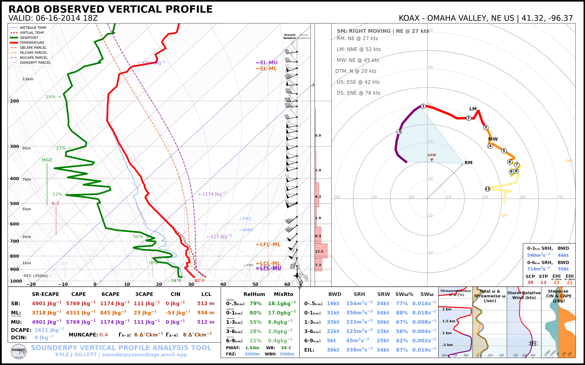

.. _tutorial-parcel-settings:

==================
🧪 Parcel Settings
==================

SounderPy sounding plots can display several parcel traces. The
``special_parcels`` argument provides three useful levels of control:

* ``None`` — standard SounderPy parcel behavior;
* ``"simple"`` — omit the additional most-unstable ECAPE trace while retaining
  the basic parcel traces;
* a custom nested list — explicitly select highlighted and background parcel
  traces.

The custom parcel calculations use parcel definitions supported by the
``ecape-parcels`` integration.

***************************************************************
 
Retrieve the Example Sounding
=============================

.. code-block:: python

   import sounderpy as spy

   data = spy.get_obs_data(
       "OAX",
       "2014", "06", "16", "18",
       hush=True,
   )

***************************************************************
 
Default Parcel Behavior
=======================

With ``special_parcels=None``, SounderPy uses its normal parcel configuration:

.. code-block:: python

   spy.build_sounding(
       data,
       special_parcels=None,
       radar=None,
       map_zoom=0,
   )

.. image:: ../_static/gallery/parcels/parcels_default.png
   :alt: SounderPy sounding using default parcel settings
   :width: 85%
   :align: center

When applicable to the profile, the default behavior includes the standard
surface-based, mixed-layer, and most-unstable CAPE parcel traces and the
additional most-unstable ECAPE trace.

***************************************************************
 

Simple Parcel Behavior
======================

Use ``special_parcels="simple"`` for the simpler parcel configuration:

.. code-block:: python

   spy.build_sounding(
       data,
       special_parcels="simple",
       radar=None,
       map_zoom=0,
   )

The simple option retains the standard CAPE parcel traces while skipping the
additional most-unstable ECAPE parcel calculation/trace.

***************************************************************
 
Custom Parcel Configuration
===========================

For full control, provide a nested list containing exactly two lists:

.. code-block:: python

   special_parcels = [
       ["highlighted parcels"],
       ["background parcels"],
   ]

The first list contains parcel codes that should be emphasized. The second list
contains parcel codes that should be shown as background/reference traces.

For example:

.. code-block:: python

   custom_parcels = [
       ["sb_ia_ecape"],
       ["sb_ps_ecape", "sb_ps_cape"],
   ]

   spy.build_sounding(
       data,
       special_parcels=custom_parcels,
       radar=None,
       map_zoom=0,
   )

.. image:: ../_static/gallery/parcels/parcels_custom.png
   :alt: SounderPy sounding using custom parcel settings
   :width: 85%
   :align: center

***************************************************************
 

Understanding Parcel Codes
==========================

Each parcel code contains three components:

.. code-block:: text

   PARCELTYPE_ADIABATICSCHEME_CAPETYPE

For example:

.. code-block:: text

   sb_ia_ecape
   │  │   │
   │  │   └── ECAPE
   │  └────── irreversible-adiabatic
   └───────── surface-based

Parcel Type
-----------

``sb``
   Surface-based parcel.

``ml``
   Mixed-layer parcel.

``mu``
   Most-unstable parcel.

Adiabatic Scheme
----------------

``ps``
   Pseudoadiabatic.

``ia``
   Irreversible-adiabatic.

CAPE Type
---------

``cape``
   Traditional CAPE parcel.

``ecape``
   Entraining CAPE parcel.

Valid Parcel Codes
==================

The currently supported codes are:

.. code-block:: text

   mu_ps_cape
   mu_ia_cape
   mu_ps_ecape
   mu_ia_ecape

   ml_ps_cape
   ml_ia_cape
   ml_ps_ecape
   ml_ia_ecape

   sb_ps_cape
   sb_ia_cape
   sb_ps_ecape
   sb_ia_ecape

***************************************************************
 
Highlight Multiple Parcels
==========================

Multiple parcel traces can be emphasized:

.. code-block:: python

   custom_parcels = [
       [
           "sb_ia_ecape",
           "ml_ia_ecape",
       ],
       [
           "sb_ps_cape",
           "ml_ps_cape",
       ],
   ]

   spy.build_sounding(
       data,
       special_parcels=custom_parcels,
       radar=None,
       map_zoom=0,
   )

***************************************************************
 
Performance Considerations
==========================

Custom ECAPE parcel calculations are more computationally expensive than the
basic CAPE traces. If you only need the common parcel paths for a quick-look
figure, ``special_parcels="simple"`` is the lighter-weight option.

For publication or detailed analysis, a custom parcel configuration can make
the intended parcel comparison much clearer than plotting every available
trace.

***************************************************************
 

Next Steps
==========

Continue to :doc:`Hodograph Options <hodograph_options>` to customize storm
motion and ground-relative/storm-relative wind displays.

See also:

* :doc:`Plotting Data </plottingdata>`
