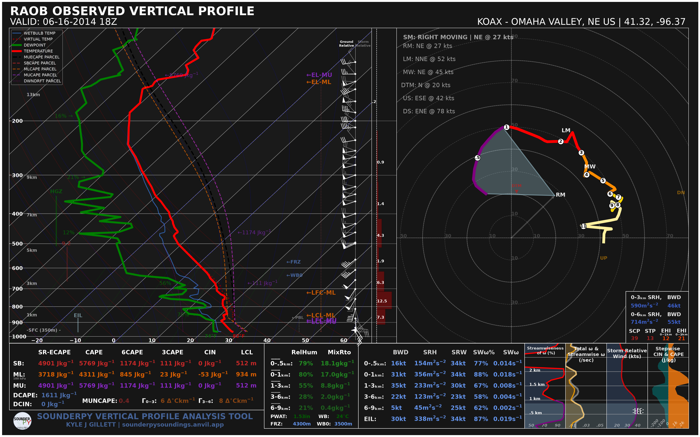
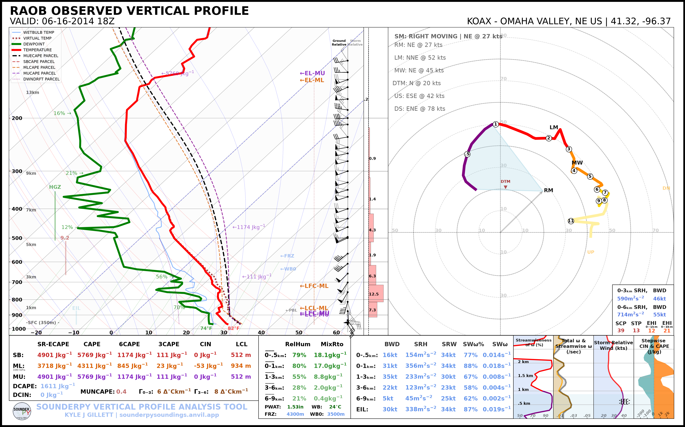
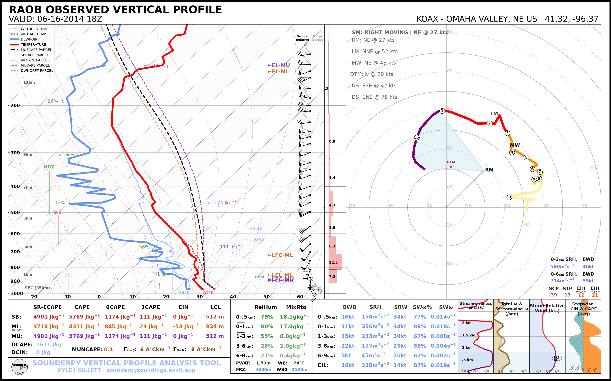

.. _tutorial-plot-appearance:

=====================================
🎨 Plot Appearance & Accessibility
=====================================

SounderPy provides several options for changing the presentation of sounding
and hodograph figures without changing the underlying atmospheric profile.

In this tutorial you will:

* retrieve one observed sounding;
* compare light and dark plotting modes;
* compare standard and color-deficiency-friendly sounding colors;
* save figures and control output resolution;
* combine appearance options;
* reproduce the same workflow from the SounderPy CLI.

Using the **same profile for each comparison** makes it easier to see exactly
what each plotting option changes.

***************************************************************
 
Retrieve the Example Sounding
=============================

The examples use the OAX observed sounding from 16 June 2014 at 18 UTC.

.. code-block:: python

   import sounderpy as spy

   data = spy.get_obs_data(
       "OAX",
       "2014",
       "06",
       "16",
       "18",
       hush=True,
   )

***************************************************************
 
Light and Dark Soundings
========================

Light Mode
----------

The default SounderPy plot uses a light background:

.. code-block:: python

   spy.build_sounding(
       data,
       dark_mode=False,
       radar=None,
       map_zoom=0,
   )

.. image:: ../_static/gallery/themes/sounding_light.png
   :alt: Light-mode SounderPy sounding
   :width: 85%
   :align: center

Dark Mode
---------

Set ``dark_mode=True`` to use the dark-background plotting theme:

.. code-block:: python

   spy.build_sounding(
       data,
       dark_mode=True,
       radar=None,
       map_zoom=0,
   )

The profile data and parameter calculations are unchanged; only the
presentation is different.

***************************************************************
 
Light and Dark Hodographs
=========================

The same ``dark_mode`` argument is available for standalone hodographs.

.. list-table::
   :widths: 50 50
   :class: gallery-table

   * - .. image:: ../_static/gallery/themes/hodograph_light.png
          :alt: Light-mode SounderPy hodograph
          :width: 100%

       **Light Mode**

     - .. image:: ../_static/gallery/themes/hodograph_dark.png
          :alt: Dark-mode SounderPy hodograph
          :width: 100%

       **Dark Mode**

Create them with:

.. code-block:: python

   spy.build_hodograph(
       data,
       dark_mode=False,
       radar=None,
       map_zoom=0,
   )

   spy.build_hodograph(
       data,
       dark_mode=True,
       radar=None,
       map_zoom=0,
   )

***************************************************************
 
Color-Deficiency-Friendly Soundings
===================================

SounderPy can change the dewpoint-trace styling to improve visual distinction
for users with color-vision deficiencies.

Standard Colors
---------------

.. code-block:: python

   spy.build_sounding(
       data,
       color_blind=False,
       radar=None,
       map_zoom=0,
   )

Color-Deficiency-Friendly Colors
--------------------------------

.. code-block:: python

   spy.build_sounding(
       data,
       color_blind=True,
       radar=None,
       map_zoom=0,
   )

***************************************************************
 
Combining Appearance Options
============================

Appearance options can be combined:

.. code-block:: python

   spy.build_sounding(
       data,
       dark_mode=True,
       color_blind=True,
       radar=None,
       map_zoom=0,
   )

***************************************************************
 
Saving Figures
==============

Set ``save=True`` and provide ``filename`` to save a figure instead of showing
it interactively:

.. code-block:: python

   spy.build_sounding(
       data,
       dark_mode=True,
       radar=None,
       map_zoom=0,
       save=True,
       filename="oax_dark_sounding.png",
   )

The default figure resolution is 100 DPI. Increase it with ``dpi``:

.. code-block:: python

   spy.build_sounding(
       data,
       dark_mode=True,
       radar=None,
       map_zoom=0,
       dpi=200,
       save=True,
       filename="oax_dark_sounding.png",
   )

***************************************************************
 
CLI Equivalents
===============

Light-mode sounding:

.. code-block:: bash

   sounderpy obs OAX 2014-06-16 18 \
       --plot sounding \
       --map-zoom 0

Dark-mode sounding:

.. code-block:: bash

   sounderpy obs OAX 2014-06-16 18 \
       --plot sounding \
       --dark-mode \
       --map-zoom 0 \
       --plot-file oax_dark.png

Color-deficiency-friendly sounding:

.. code-block:: bash

   sounderpy obs OAX 2014-06-16 18 \
       --plot sounding \
       --color-blind \
       --map-zoom 0 \
       --plot-file oax_colorblind.png

Combined:

.. code-block:: bash

   sounderpy obs OAX 2014-06-16 18 \
       --plot sounding \
       --dark-mode \
       --color-blind \
       --map-zoom 0 \
       --dpi 200 \
       --plot-file oax_dark_colorblind.png

***************************************************************
 
Next Steps
==========

Continue to :doc:`Maps & Radar <maps_radar>` to control the geographic inset
and radar display.

See also:

* :doc:`Plotting Data </plottingdata>`
* :doc:`Plot Gallery </examplegallery>`
* :doc:`Command Line Tool </cli>`
